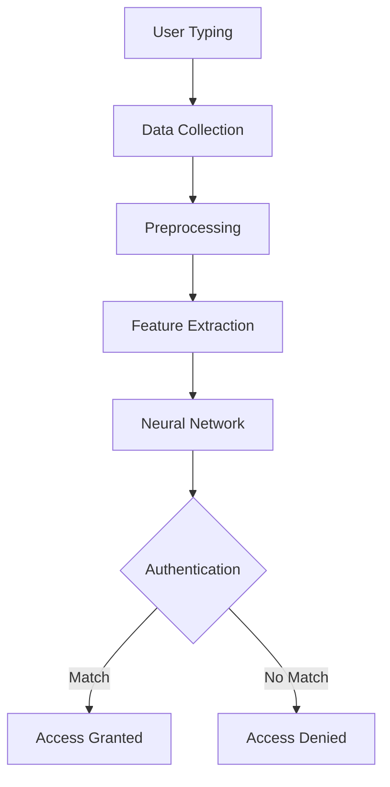

# Behavioral Biometric Authentication System

[](https://www.python.org/downloads/)
[](https://opensource.org/licenses/MIT)
[](https://github.com/yourusername/behavioral-biometrics-auth)

A neural network-based authentication system using keystroke dynamics to identify users by their unique typing patterns. Developed by Computer Science students at the College of Applied Sciences, Riyadh.


## 📖 Table of Contents
- [Features](#-features)
- [Installation](#-installation)
- [Usage](#-usage)
- [Dataset](#-dataset)
- [Architecture](#-architecture)
- [Results](#-results)
- [References](#-references)
- [License](#-license)

## 🌟 Features
- **Behavioral Biometrics Analysis**
  - Hold time measurement
  - Release time calculation
  - Typing speed estimation
- **Deep Learning Model**
  - Multi-layer Perceptron (MLP) architecture
  - ReLU activation and Dropout layers
  - Adam optimizer with categorical crossentropy
- **Real-Time Authentication**
  - Dynamic keystroke processing
  - Continuous user verification
- **Comprehensive Visualization**
  - Feature distribution plots
  - User comparison matrices
  - Training performance graphs

## ⚙️ Installation

1. **Clone repository**
```bash
git clone https://github.com/yourusername/behavioral-biometrics-auth.git
cd behavioral-biometrics-auth
```

2. **Install requirements**
```bash
pip install -r requirements.txt
```

Sample `requirements.txt`:
```
tensorflow==2.12.0
pandas==2.0.1
numpy==1.24.3
matplotlib==3.7.1
seaborn==0.12.2
scikit-learn==1.2.2
python-dateutil==2.8.2
keyboard==0.13.5
```

## 🖥️ Usage

### Data Collection
```python
python src/collect_data.py
```
Interactive collection of keystroke patterns:
- Records key press/release timestamps
- Stores data in CSV format
- Supports multiple users

### Model Training
```python
python src/train_model.py
```
- Processes collected data
- Trains neural network model
- Saves best-performing weights

### Authentication Test
```python
python src/authenticate.py
```
- Real-time typing pattern analysis
- Compares input with stored profiles
- Returns authentication decision

## 📊 Dataset

**Structure**:
| Column          | Description                          |
|-----------------|--------------------------------------|
| User ID         | Unique participant identifier        |
| Key Code        | ASCII code of pressed key            |
| Hold Time       | Duration key is pressed (ms)         |
| Down-Down Time  | Interval between key presses (ms)    |
| Up-Down Time    | Time between release and next press  |
| Typing Speed    | Calculated keys per second           |

**Sample Distribution**:


## 🏗️ Architecture



**Key Components**:
1. Data Collection Module
2. Preprocessing Pipeline
3. MLP Classifier (128-64-Output layers)
4. Decision Module with Thresholding

## 📈 Results

### Performance Metrics
| Metric     | Score  |
|------------|--------|
| Accuracy   | 88.0%  |
| Precision  | 85.2%  |
| Recall     | 82.7%  |
| F1-Score   | 83.9%  |

### Training Progress


### User Comparison


